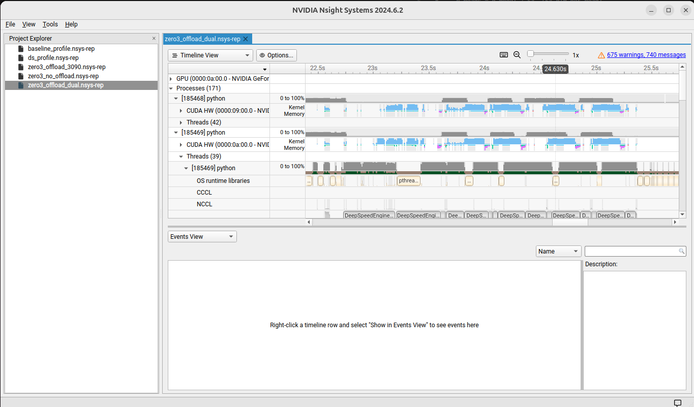

# DeepSpeed Study — Decoder-only Transformer

A hands-on study of [DeepSpeed](https://github.com/microsoft/DeepSpeed) using a LLaMA-style decoder-only Transformer on heterogeneous multi-GPU hardware.

---

## Hardware

| GPU | VRAM | Relative Performance |
|---|---|---|
| RTX 3090 | 24 GB | 2.5x |
| RTX 2080 Ti | 11 GB | 1.0x |

---

## Model

A scaled-down LLaMA-style GPT decoder (`model.py`):

| Hyperparameter | Value |
|---|---|
| `vocab_size` | 32,000 |
| `seq_len` | 512 |
| `d_model` | 512 |
| `n_heads` | 8 (64-dim per head) |
| `n_layers` | 8 |
| `d_ff` | 2,048 (4 × d_model) |
| `dropout` | 0.0 |

Architecture details:
- Pre-LayerNorm decoder blocks
- Causal (autoregressive) self-attention mask
- Weight tying between token embedding and output projection

---

## Training Strategy

### Step 1 — Baseline (single GPU)
`train_baseline.py` establishes the reference throughput on a single RTX 3090.

### Step 2 — Estimate VRAM per sample
`profile_vram.py` increases `batch_size` from 1 and records VRAM usage to estimate activation memory per sample.

### Step 3 — DeepSpeed ZeRO-3 + CPU Offload (single GPU)
`train_deepspeed.py` with `ds_config.json`:

**What lives where:**

```
GPU  : activations, gradients (during backward)
       model params gathered layer-by-layer from CPU on demand

CPU  : all model parameters (stored, fetched per layer during fwd/bwd)
       optimizer states (Adam m/v) + fp32 master weights
       → DeepSpeedCPUAdam runs the update step entirely on CPU
```

ZeRO-3 fetches parameters **layer by layer** during both forward and backward passes. The `stage3_prefetch_bucket_size` setting overlaps the next layer's CPU→GPU transfer with the current layer's computation, hiding transfer latency.

### Step 4 — Heterogeneous Dual-GPU with Performance-Proportional Batch Split
`batch_allocator.py` splits the total batch so that both GPUs finish at the same time:

```
batch_i / perf_i = constant  for all GPUs
```

For `total_batch = 80`:
- RTX 3090  → **57 samples** (2.5 / 3.5 × 80)
- RTX 2080 Ti → **23 samples** (1.0 / 3.5 × 80)

Without this split, the 3090 would finish 2.5x sooner and sit idle waiting for the 2080 Ti.

---

## File Overview

| File | Description |
|---|---|
| `model.py` | GPT-style decoder-only Transformer |
| `config.yaml` | Model & training hyperparameters |
| `train_baseline.py` | Single-GPU baseline training loop |
| `train_deepspeed.py` | DeepSpeed ZeRO-3 training with heterogeneous batch split |
| `ds_config.json` | DeepSpeed config (ZeRO stage, offload, optimizer, fp16) |
| `batch_allocator.py` | Performance-proportional batch allocation for heterogeneous GPUs |
| `profile_vram.py` | VRAM profiling to estimate activation memory per sample |

---

## Usage

### Single GPU (3090) with nsys profiling
```bash
nsys profile -f true -o zero3_offload_3090 \
    deepspeed --include localhost:0 train_deepspeed.py
```

### Dual GPU with nsys profiling
```bash
nsys profile -f true -o zero3_offload_dual \
    deepspeed --include localhost:0,1 train_deepspeed.py
```

### Open nsys GUI
```bash
nsys-ui zero3_offload_dual.nsys-rep
```

---

## Nsight Systems — Dual GPU ZeRO-3 Offload

The timeline below shows two GPUs running ZeRO-3 with CPU offload. The colored blocks are CUDA kernels (compute); the gaps between them are CPU↔GPU memory transfers for layer-by-layer parameter fetching. `stage3_prefetch_bucket_size` overlaps these transfers with the next layer's compute to reduce stalls.



---

## DeepSpeed Config (`ds_config.json`)

```json
{
  "zero_optimization": {
    "stage": 3,
    "offload_optimizer": { "device": "cpu", "pin_memory": true },
    "offload_param":     { "device": "cpu", "pin_memory": true },
    "stage3_prefetch_bucket_size":        50000000,
    "stage3_param_persistence_threshold": 100000,
    "stage3_max_live_parameters":         1000000000,
    "stage3_max_reuse_distance":          1000000000
  },
  "fp16": { "enabled": true }
}
```
